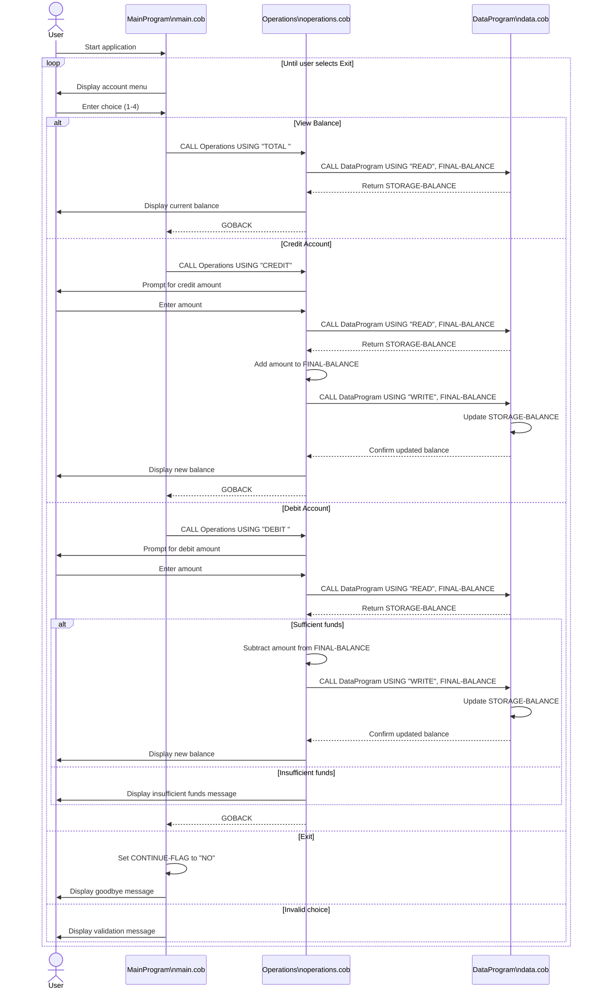

# COBOL Student Account Documentation

## Overview

This COBOL sample implements a small account management flow that can be understood as a student account ledger. The program is split into three COBOL modules:

- `main.cob` provides the menu-driven user interface.
- `operations.cob` applies account actions such as viewing, crediting, and debiting the balance.
- `data.cob` acts as a simple in-memory data store for the current balance.

The modules communicate through `CALL ... USING` and exchange operation codes and balance values through linkage parameters.

## File Purposes

### `src/cobol/main.cob`

Purpose:
Provides the interactive entry point for the application.

Key logic:

- Displays the Account Management System menu.
- Accepts a user selection from `1` to `4`.
- Routes the request to the `Operations` program using these operation codes:
  - `TOTAL ` for viewing the current balance
  - `CREDIT` for adding funds
  - `DEBIT ` for removing funds
- Repeats until the user selects `4` to exit.
- Rejects unsupported menu choices with an error message.

### `src/cobol/operations.cob`

Purpose:
Implements the business operations performed against the student account balance.

Key logic:

- Receives an operation code from `MainProgram`.
- For `TOTAL `:
  - Calls `DataProgram` with `READ`.
  - Displays the current balance.
- For `CREDIT`:
  - Accepts a credit amount.
  - Reads the latest balance from `DataProgram`.
  - Adds the amount to the balance.
  - Writes the updated balance back through `DataProgram`.
  - Displays the new balance.
- For `DEBIT `:
  - Accepts a debit amount.
  - Reads the latest balance from `DataProgram`.
  - Checks whether sufficient funds exist.
  - Subtracts the amount only when the balance is large enough.
  - Writes the updated balance back through `DataProgram`.
  - Otherwise displays an insufficient-funds message.

### `src/cobol/data.cob`

Purpose:
Stores and returns the current account balance.

Key logic:

- Maintains `STORAGE-BALANCE` in working storage.
- Responds to `READ` by copying `STORAGE-BALANCE` into the passed balance field.
- Responds to `WRITE` by replacing `STORAGE-BALANCE` with the passed balance field.

This module behaves like a minimal persistence layer, but only for the lifetime of the running program.

## Program Flow

1. `MainProgram` prompts the user for an action.
2. `MainProgram` calls `Operations` with a six-character action code.
3. `Operations` reads or updates the balance by calling `DataProgram`.
4. `DataProgram` either returns the stored balance or saves a new one.
5. Control returns to `MainProgram` for the next menu selection.

## Business Rules For Student Accounts

The current implementation implies these business rules:

- The system manages one active student account balance at a time.
- The starting balance is `1000.00`.
- A balance inquiry does not change stored data.
- A credit increases the account balance by the entered amount.
- A debit decreases the account balance only when sufficient funds are available.
- Debits that exceed the available balance are rejected.
- The balance is stored only in program memory; it is not written to a database or file.
- There is no student identifier, transaction history, audit trail, or multi-account support in the current design.

## Important Technical Notes

- Operation codes are fixed-width six-character values, so padding matters:
  - `TOTAL ` includes a trailing space.
  - `DEBIT ` includes a trailing space.
  - `READ` and `WRITE` are compared against six-character fields.
- The balance and amount fields use `PIC 9(6)V99`, which supports up to six digits before the decimal and two implied decimal places.
- Input validation is minimal. The programs assume accepted amounts and menu choices are valid for their target fields.

## Summary

This codebase separates user interaction, account operations, and balance storage into distinct COBOL programs. That makes it easier to understand the current student account workflow and provides a clear starting point for future modernization, such as adding named student accounts, persistent storage, and stronger validation.

## Sequence Diagram

