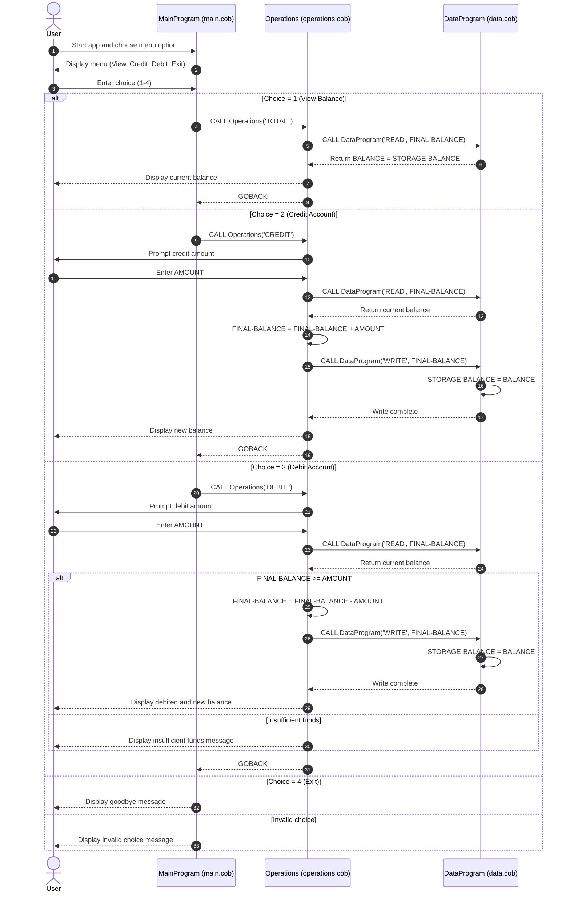

# COBOL Student Account System Documentation

## Overview

This COBOL module implements a simple student account management flow with three programs:

- `main.cob`: User-facing menu and control loop
- `operations.cob`: Business operations for balance inquiry, credit, and debit
- `data.cob`: In-memory data access layer for reading and writing balance

Together, these programs model a basic student account where users can view balance, add funds, and deduct funds.

## File Purposes

### `main.cob` (`PROGRAM-ID. MainProgram`)

Purpose:
- Runs the interactive console menu.
- Collects user choices and routes requests to the Operations program.

Key logic:
- Displays options: View Balance, Credit Account, Debit Account, Exit.
- Uses `EVALUATE USER-CHOICE` to map user input to operations.
- Calls `Operations` with one of these operation codes:
  - `TOTAL ` for balance inquiry
  - `CREDIT` for adding funds
  - `DEBIT ` for deducting funds
- Repeats until the user selects Exit.

Notes:
- Invalid choices are handled with a message and loop continuation.

### `operations.cob` (`PROGRAM-ID. Operations`)

Purpose:
- Applies account business operations based on operation code passed from `MainProgram`.

Key logic:
- Receives `PASSED-OPERATION` through linkage and moves it to `OPERATION-TYPE`.
- For `TOTAL `:
  - Calls `DataProgram` with `READ` to fetch current balance.
  - Displays current balance.
- For `CREDIT`:
  - Prompts user for amount.
  - Reads current balance.
  - Adds amount.
  - Writes updated balance via `DataProgram` with `WRITE`.
- For `DEBIT `:
  - Prompts user for amount.
  - Reads current balance.
  - Debits only if funds are sufficient.
  - Writes updated balance when debit succeeds.
  - Displays insufficient funds message otherwise.

Notes:
- `FINAL-BALANCE` is initialized to `1000.00`, but authoritative state comes from `DataProgram` after `READ`.

### `data.cob` (`PROGRAM-ID. DataProgram`)

Purpose:
- Encapsulates account balance storage and provides read/write access to it.

Key logic:
- Maintains `STORAGE-BALANCE` in working storage, initialized to `1000.00`.
- Accepts two linkage inputs:
  - `PASSED-OPERATION` (`READ` or `WRITE`)
  - `BALANCE` (value returned or persisted)
- If operation is `READ`, moves internal balance out to `BALANCE`.
- If operation is `WRITE`, updates internal storage from `BALANCE`.

Notes:
- Acts like an in-memory persistence layer for the running process.

## Key Business Rules for Student Accounts

1. Initial account balance starts at `1000.00`.
2. `CREDIT` operation increases balance by entered amount.
3. `DEBIT` operation decreases balance only when `balance >= debit amount`.
4. Overdrafts are not allowed; insufficient funds result in no balance change.
5. `TOTAL ` operation is read-only and does not modify account state.
6. Menu loop continues until user explicitly selects Exit.

## Data and Interface Contracts

- Operation codes are fixed-width strings and include trailing spaces where required:
  - `TOTAL ` (6 chars)
  - `DEBIT ` (6 chars)
  - `CREDIT` (6 chars)
  - `READ` / `WRITE` used internally between `Operations` and `DataProgram`
- Monetary fields use `PIC 9(6)V99` (up to 999999.99 without sign).

## Call Flow Summary

1. `MainProgram` accepts menu input.
2. `MainProgram` calls `Operations` with the selected operation code.
3. `Operations` calls `DataProgram`:
   - `READ` before displaying/modifying balance
   - `WRITE` after successful credit/debit updates
4. Control returns to `MainProgram` for next user action.

## How to Run the COBOL Programs

### Prerequisites

- Install GnuCOBOL so the `cobc` compiler is available.
- Confirm installation:

```bash
cobc -V
```

### Build and run

From the repository root, move into the COBOL source directory and compile all modules together:

```bash
cd src/cobol
cobc -x -free -o account_app main.cob operations.cob data.cob
./account_app
```

### What to expect

- The app displays an account menu with options to view balance, credit, debit, or exit.
- Enter `1`, `2`, `3`, or `4` to perform operations.
- Credit/debit actions prompt for an amount and then display the updated balance or an insufficient-funds message.

### Troubleshooting

- If `cobc: command not found`, install GnuCOBOL and retry.
- If compile options fail in your environment, remove `-free` if your compiler expects fixed-format source.

## Sequence Diagram (Mermaid)


